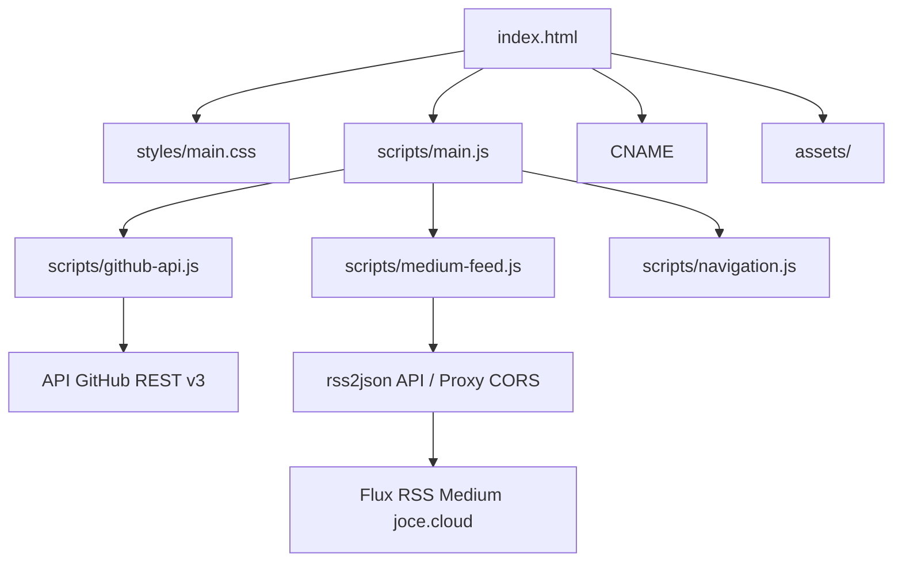
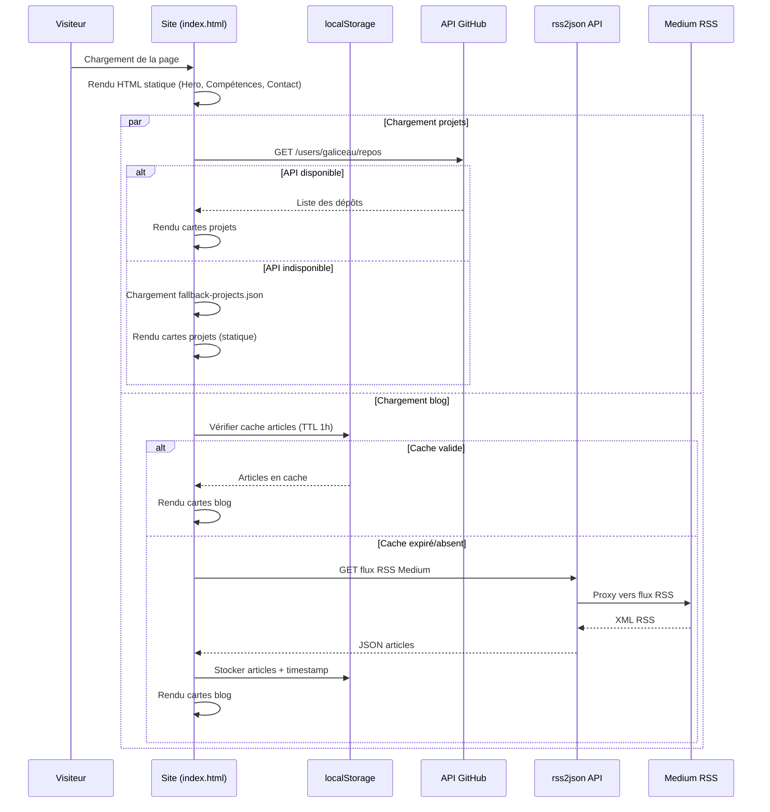

# Document de Conception — Portfolio GitHub Pages

## Vue d'ensemble

Ce document décrit la conception technique du site portfolio statique GitHub Pages pour Jocelyn Fontaine (Galiceau). Le site est une application mono-page (SPA) en HTML/CSS/JavaScript vanilla, hébergée sur `galiceau.github.io` avec le domaine personnalisé `github.joce.cloud`.

Le site est conçu sans framework ni bundler pour maximiser la compatibilité GitHub Pages, la performance et la simplicité de déploiement. Il intègre deux sources de données externes : l'API GitHub (projets) et le flux RSS Medium (articles de blog), avec des mécanismes de repli statique et de cache localStorage.

### Décisions de conception clés

| Décision | Choix | Justification |
|---|---|---|
| Framework | Aucun (vanilla HTML/CSS/JS) | Compatibilité GitHub Pages, performance, zéro dépendance de build |
| CSS | Variables CSS custom + Flexbox/Grid | Thème cohérent, responsive natif, pas de dépendance externe |
| API GitHub | Fetch API + fallback statique | Données dynamiques avec résilience |
| Blog Medium | RSS via proxy CORS (rss2json) | Contournement CORS, format JSON exploitable |
| Cache | localStorage avec TTL 1h | Réduction des appels API, chargement rapide |
| Icônes | SVG inline ou Font Awesome CDN | Léger, accessible, personnalisable |

## Architecture

### Architecture globale

Le site suit une architecture statique mono-page avec séparation des responsabilités :



### Structure des fichiers

```
galiceau.github.io/
├── index.html              # Page unique SPA
├── CNAME                   # Domaine personnalisé github.joce.cloud
├── favicon.ico             # Favicon
├── styles/
│   └── main.css            # Feuille de style unique avec variables CSS
├── scripts/
│   ├── main.js             # Point d'entrée, initialisation
│   ├── navigation.js       # Navigation sticky, smooth scroll, hamburger
│   ├── github-api.js       # Récupération projets GitHub + fallback
│   └── medium-feed.js      # Récupération articles Medium + cache
├── assets/
│   ├── images/             # Photos, logos, images de fond
│   └── icons/              # Icônes SVG des compétences
└── data/
    └── fallback-projects.json  # Données statiques de repli pour les projets
```

### Flux de données



## Composants et Interfaces

### 1. Module Navigation (`navigation.js`)

Gère la barre de navigation sticky, le défilement fluide et le menu hamburger mobile.

```javascript
/**
 * Initialise la navigation du site
 */
function initNavigation() { }

/**
 * Active/désactive le menu hamburger
 */
function toggleMobileMenu() { }

/**
 * Défilement fluide vers une section
 * @param {string} sectionId - L'identifiant de la section cible
 */
function scrollToSection(sectionId) { }

/**
 * Met à jour le lien actif dans la navigation selon la position de défilement
 */
function updateActiveNavLink() { }
```

### 2. Module API GitHub (`github-api.js`)

Récupère les projets depuis l'API GitHub avec mécanisme de repli.

```javascript
/**
 * @typedef {Object} Project
 * @property {string} name - Nom du dépôt
 * @property {string} description - Description du dépôt
 * @property {string} html_url - URL vers le dépôt GitHub
 * @property {string[]} topics - Technologies/tags du dépôt
 * @property {string} language - Langage principal
 * @property {number} stargazers_count - Nombre d'étoiles
 */

/**
 * Récupère les projets depuis l'API GitHub
 * @param {string} username - Nom d'utilisateur GitHub
 * @returns {Promise<Project[]>} Liste des projets
 */
async function fetchGitHubProjects(username) { }

/**
 * Charge les projets de repli depuis le fichier JSON statique
 * @returns {Promise<Project[]>} Liste des projets statiques
 */
async function loadFallbackProjects() { }

/**
 * Génère le HTML d'une carte projet
 * @param {Project} project - Données du projet
 * @returns {string} HTML de la carte
 */
function renderProjectCard(project) { }
```

### 3. Module Flux Medium (`medium-feed.js`)

Récupère et met en cache les articles du blog Medium.

```javascript
/**
 * @typedef {Object} Article
 * @property {string} title - Titre de l'article
 * @property {string} link - URL vers l'article Medium
 * @property {string} pubDate - Date de publication ISO
 * @property {string} description - Extrait de l'article
 * @property {string} thumbnail - URL de l'image de couverture
 */

/**
 * Récupère les articles Medium avec gestion du cache localStorage
 * @param {string} feedUrl - URL du flux RSS Medium
 * @param {number} maxArticles - Nombre maximum d'articles (défaut: 6)
 * @returns {Promise<Article[]>} Liste des articles
 */
async function fetchMediumArticles(feedUrl, maxArticles = 6) { }

/**
 * Vérifie si le cache localStorage est encore valide
 * @param {string} cacheKey - Clé du cache
 * @param {number} ttlMs - Durée de vie en millisecondes
 * @returns {Article[]|null} Articles en cache ou null si expiré
 */
function getCachedArticles(cacheKey, ttlMs) { }

/**
 * Stocke les articles dans le cache localStorage
 * @param {string} cacheKey - Clé du cache
 * @param {Article[]} articles - Articles à mettre en cache
 */
function cacheArticles(cacheKey, articles) { }

/**
 * Génère le HTML d'une carte article
 * @param {Article} article - Données de l'article
 * @returns {string} HTML de la carte
 */
function renderArticleCard(article) { }
```

### 4. Point d'entrée (`main.js`)

Orchestre l'initialisation de tous les modules au chargement de la page.

```javascript
/**
 * Initialise le site au chargement du DOM
 */
document.addEventListener('DOMContentLoaded', () => {
  initNavigation();
  loadProjects();
  loadBlogArticles();
});
```

## Modèles de données

### Project (Projet GitHub)

| Champ | Type | Source | Description |
|---|---|---|---|
| `name` | `string` | API GitHub / fallback | Nom du dépôt |
| `description` | `string` | API GitHub / fallback | Description du projet |
| `html_url` | `string` | API GitHub / fallback | URL vers le dépôt |
| `topics` | `string[]` | API GitHub / fallback | Technologies utilisées |
| `language` | `string` | API GitHub / fallback | Langage principal |
| `stargazers_count` | `number` | API GitHub / fallback | Nombre d'étoiles |

### Article (Article Medium)

| Champ | Type | Source | Description |
|---|---|---|---|
| `title` | `string` | RSS / cache | Titre de l'article |
| `link` | `string` | RSS / cache | URL vers l'article complet |
| `pubDate` | `string` | RSS / cache | Date de publication (ISO 8601) |
| `description` | `string` | RSS / cache | Extrait HTML de l'article |
| `thumbnail` | `string` | RSS / cache | URL de l'image de couverture |

### CacheEntry (Entrée de cache localStorage)

| Champ | Type | Description |
|---|---|---|
| `timestamp` | `number` | Timestamp Unix du moment de la mise en cache |
| `data` | `Article[]` | Articles mis en cache |

### Variables CSS (Thème)

```css
:root {
  /* Couleurs principales */
  --color-navy: #0a0a1e;
  --color-purple: #1e0a1e;
  --color-bordeaux: #6b1d2a;
  --color-white: #ffffff;
  --color-light-gray: #f5f5f5;
  
  /* Typographie */
  --font-primary: 'Inter', 'Segoe UI', sans-serif;
  --font-heading: 'Space Grotesk', 'Inter', sans-serif;
  
  /* Breakpoints (référence, utilisés dans media queries) */
  /* Mobile: < 768px */
  /* Tablette: 768px - 1024px */
  /* Desktop: > 1024px */
  
  /* Espacement */
  --spacing-xs: 0.5rem;
  --spacing-sm: 1rem;
  --spacing-md: 2rem;
  --spacing-lg: 4rem;
  --spacing-xl: 6rem;
}
```

## Propriétés de Correction

*Une propriété est une caractéristique ou un comportement qui doit rester vrai pour toutes les exécutions valides d'un système — essentiellement, une déclaration formelle de ce que le système doit faire. Les propriétés servent de pont entre les spécifications lisibles par l'humain et les garanties de correction vérifiables par la machine.*

### Propriété 1 : Les cartes projet contiennent toutes les informations requises

*Pour tout* objet Project valide (avec name, description, topics et html_url non vides), le HTML généré par `renderProjectCard` doit contenir le nom du projet, sa description, les technologies utilisées et un lien vers le dépôt GitHub.

**Valide : Exigence 6.1**

### Propriété 2 : Les cartes article contiennent toutes les informations requises

*Pour tout* objet Article valide (avec title, pubDate, description et thumbnail non vides), le HTML généré par `renderArticleCard` doit contenir le titre, la date de publication, l'extrait et l'image de couverture.

**Valide : Exigence 7.2**

### Propriété 3 : Aller-retour du cache localStorage

*Pour toute* liste d'articles valides et tout timestamp, stocker les articles via `cacheArticles` puis les récupérer via `getCachedArticles` avec un timestamp inférieur au TTL (1 heure) doit retourner exactement les mêmes articles. Si le timestamp dépasse le TTL, `getCachedArticles` doit retourner `null`.

**Valide : Exigence 7.5**

### Propriété 4 : Aller-retour des données structurées JSON-LD

*Pour tout* objet Person valide contenant les champs professionnels requis (name, jobTitle, url, sameAs), la sérialisation en JSON-LD puis le parsing du JSON résultant doit produire un objet contenant tous les champs d'origine avec les mêmes valeurs.

**Valide : Exigence 10.4**

## Gestion des erreurs

### API GitHub indisponible

| Scénario | Comportement | Implémentation |
|---|---|---|
| Erreur réseau / timeout | Chargement du fichier `fallback-projects.json` | `try/catch` autour du `fetch`, appel à `loadFallbackProjects()` |
| Réponse HTTP 4xx/5xx | Chargement du fichier de repli | Vérification `response.ok` avant parsing |
| JSON invalide | Chargement du fichier de repli | `try/catch` autour du `response.json()` |

### Flux RSS Medium indisponible

| Scénario | Comportement | Implémentation |
|---|---|---|
| Erreur réseau / timeout | Affichage d'un message informatif + lien vers le profil Medium | `try/catch` autour du `fetch` |
| Proxy rss2json indisponible | Même comportement de repli | Détection d'erreur HTTP |
| Données RSS malformées | Affichage du message de repli | Validation de la structure JSON reçue |

### Cache localStorage

| Scénario | Comportement | Implémentation |
|---|---|---|
| localStorage indisponible (navigation privée) | Récupération directe depuis l'API sans cache | `try/catch` autour des appels `localStorage` |
| Données en cache corrompues | Suppression du cache, nouvelle récupération | Validation JSON au parsing, `removeItem` si invalide |
| Cache expiré (> 1h) | Nouvelle récupération depuis l'API | Comparaison `Date.now() - timestamp > TTL` |

### Navigation

| Scénario | Comportement | Implémentation |
|---|---|---|
| Section cible inexistante | Aucune action (pas d'erreur) | Vérification `document.getElementById()` avant scroll |
| JavaScript désactivé | Navigation par ancres HTML native | Liens `href="#section"` fonctionnels sans JS |

## Stratégie de tests

### Tests unitaires (exemples spécifiques)

Les tests unitaires vérifient des scénarios concrets et des cas limites :

- **Navigation** : Vérifier que les liens de navigation pointent vers les bonnes ancres (3.1), que le menu hamburger s'affiche sous 768px (3.4)
- **Hero** : Vérifier la présence du nom, titre, devise et liens de profil (4.1–4.5)
- **Compétences** : Vérifier le regroupement par catégories (5.1)
- **Projets** : Vérifier le mécanisme de repli quand l'API échoue (6.4), les liens en nouvel onglet (6.2)
- **Blog** : Vérifier le message de repli quand le RSS échoue (7.4), les liens en nouvel onglet (7.3)
- **Contact** : Vérifier la présence des liens et de la localisation (8.1–8.3)
- **Accessibilité** : Vérifier les balises sémantiques (9.2), les attributs alt (9.3), les ratios de contraste (9.4)
- **SEO** : Vérifier les balises Open Graph (10.1), la meta description (10.2), le JSON-LD (10.4)

### Tests basés sur les propriétés (property-based testing)

Bibliothèque : **fast-check** (JavaScript)

Chaque test de propriété doit exécuter un minimum de **100 itérations** et référencer la propriété de conception correspondante.

| Propriété | Tag de test | Description |
|---|---|---|
| Propriété 1 | `Feature: github-pages-portfolio, Property 1: Les cartes projet contiennent toutes les informations requises` | Génère des objets Project aléatoires, vérifie que le HTML rendu contient tous les champs |
| Propriété 2 | `Feature: github-pages-portfolio, Property 2: Les cartes article contiennent toutes les informations requises` | Génère des objets Article aléatoires, vérifie que le HTML rendu contient tous les champs |
| Propriété 3 | `Feature: github-pages-portfolio, Property 3: Aller-retour du cache localStorage` | Génère des listes d'articles et timestamps aléatoires, vérifie le round-trip du cache |
| Propriété 4 | `Feature: github-pages-portfolio, Property 4: Aller-retour des données structurées JSON-LD` | Génère des objets Person aléatoires, vérifie le round-trip JSON-LD |

### Tests d'intégration

- Vérifier l'appel à l'API GitHub avec le bon endpoint (`/users/galiceau/repos`)
- Vérifier l'appel au proxy RSS avec la bonne URL de flux Medium
- Vérifier la redirection de `galiceau.github.io` vers `github.joce.cloud` (post-déploiement)

### Tests de fumée (smoke tests)

- Vérifier que le fichier CNAME contient `github.joce.cloud`
- Vérifier que le favicon existe et est référencé dans le HTML
- Vérifier que les variables CSS contiennent les bonnes couleurs (#0a0a1e, #1e0a1e)

### Audits automatisés

- **Lighthouse CI** : Score Performance > 90, Accessibilité > 90, SEO > 90
- **axe-core** : Audit d'accessibilité automatisé pour la navigation clavier et les contrastes
